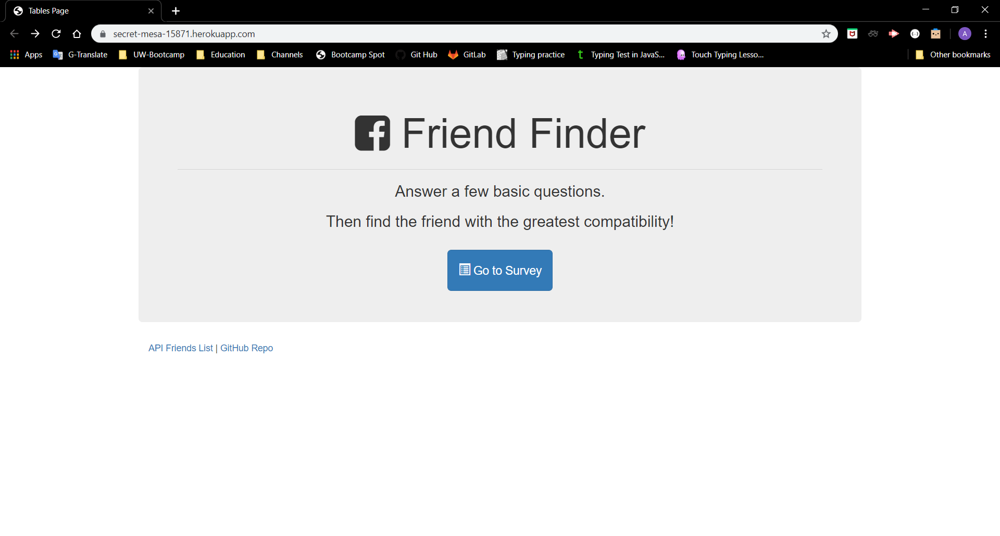
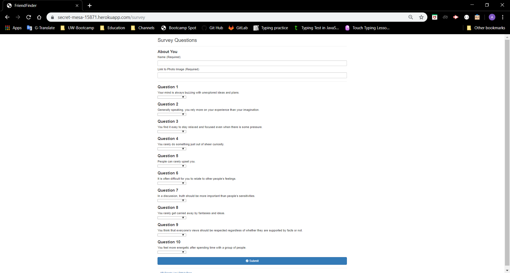
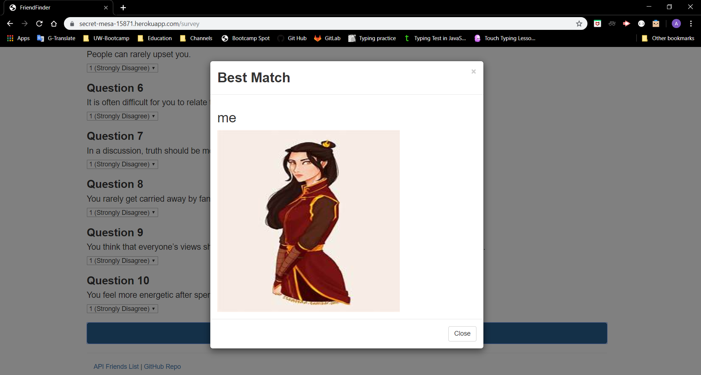

# Friend_Finder

## Overview
This application is basically a dating app. This full-stack site will take in results from the users by giving them surveys to fill out, then compare their answers with those from other users. The app will then display the name and picture of the user with the best overall match.

## Getting Started
These instructions will get you a copy of the project up and running on your local machine.

### Installing
Git clone the repository to your local machine:

HTTPS:
```
https://github.com/AmjedAyoub/Friend_Finder.git
```
SSH:
```
git@github.com:AmjedAyoub/Friend_Finder.git
```

## Instructions
### How To Use 
As a first step you should run your server using the terminal by typing this command
```javascript
node server.js
```
And then open the browser at the url:
```url
localhost:8080
``` 
You will have the page below. To start the friend finder you have to click on the `Go To Survey` button. Then the app will take you to a survey form.


The Survey form that you have to fill out.


After submitting the form, the app will give you your matching friend.



## Technologies & Tools
* HTML  
* CSS
* JavaScript
* Express

## Links
This application is deployed on GitHub Pages, [Try it yourself](https://newfriend-finder.herokuapp.com/).\
This application is published on [GitHub](https://github.com/AmjedAyoub/Friend_Finder).

## Authors
See contribution history [here](https://github.com/AmjedAyoub/Friend_Finder/graphs/contributors).